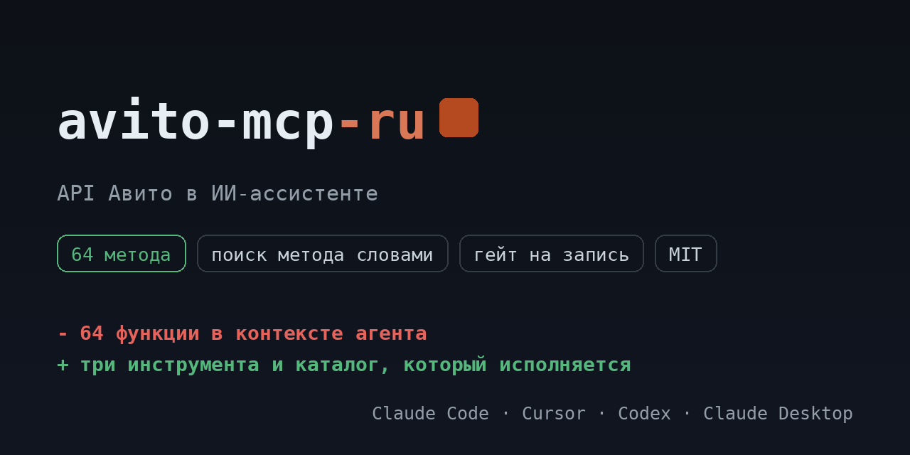

# avito-mcp-ru

<!-- mcp-name: io.github.ilyautov/avito-mcp-ru -->

API Авито для ИИ-ассистентов: объявления и статистика, чаты с покупателями, заказы и Авито Доставка, автозагрузка, продвижение, отзывы. Каталог исполняется сервером.

[](https://pypi.org/project/avito-mcp-ru/)
[](https://github.com/ilyautov/avito-mcp-ru/actions/workflows/ci.yml)
[](LICENSE)
[](#карта-методов)
[](https://marketplaces-mcp-ru.aifrontier.tech/avito-api.html)
[](https://github.com/ilyautov/avito-mcp-ru/stargazers)

<p align="center">
  <a href="https://marketplaces-mcp-ru.aifrontier.tech/avito-api.html">
    
  </a>
</p>

Пакет поднимает один сервер, Авито, и ничего больше. Сервер, каталог и
ядро приходят зависимостью из [`marketplaces-mcp-ru`](https://github.com/ilyautov/marketplaces-mcp-ru):
здесь имя, точка входа и документация под один маркетплейс.

## Установка

Первый релиз на PyPI выпускается тегом `v0.5.3`, до этого пакет ставится прямо из репозитория:

```bash
uvx --from git+https://github.com/ilyautov/avito-mcp-ru avito-mcp-ru
```

После релиза строка короче:

```bash
uvx avito-mcp-ru
```

Claude Desktop, `claude_desktop_config.json`:

```json
{
  "mcpServers": {
    "avito": {
      "command": "uvx",
      "args": ["avito-mcp-ru"],
      "env": { "AVITO_CLIENT_ID": "...", "AVITO_CLIENT_SECRET": "..." }
    }
  }
}
```

## Ключи

**Где взять пару.** На `avito.ru`: **Для бизнеса**, раздел **Интеграции**, пункт **API**. Там выдаётся `client_id` и `client_secret`. Хост запросов `api.avito.ru`.

**Как это превращается в токен.** Пара меняется на access-токен по OAuth2, срок жизни ограничен. Сервер обновляет токен сам, вручную ничего перевыпускать не нужно.

**Где всё лежит.** В `~/.marketplace-mcp/cabinets.json` с правами `chmod 600`, локально.

| переменная | секрет | что это |
|---|---|---|
| `AVITO_CLIENT_ID` | да | client_id из раздела Для бизнеса → Интеграции → API. |
| `AVITO_CLIENT_SECRET` | да | client_secret оттуда же, меняется на токен по OAuth2. |

Ключи можно не держать в окружении: сервер умеет кабинеты и кладёт их в
`~/.marketplace-mcp/cabinets.json` с правами 600, вне репозитория. Магазинов
подключается сколько нужно, переключение прямо из чата.

## Карта методов

Каталог лежит в зависимости как `avito_mcp/endpoints.yaml`:
**64 метода**, из них 40 на чтение, 22 на запись и 2 необратимых.
Сервер исполняет ровно этот файл, поэтому таблица не может разойтись с кодом.

| тема | методов | чтение | запись | необратимые |
|---|---:|---:|---:|---:|
| Мессенджер (чаты с покупателями) | 13 | 5 | 7 | 1 |
| Автозагрузка (выгрузка объявлений файлом) | 12 | 10 | 2 | 0 |
| Заказы и Авито Доставка | 12 | 6 | 6 | 0 |
| Объявления и статистика | 11 | 7 | 4 | 0 |
| Продвижение объявлений (реклама) | 7 | 6 | 1 | 0 |
| Рейтинг и отзывы | 4 | 2 | 1 | 1 |
| Пользователь, баланс и операции | 3 | 3 | 0 | 0 |
| Остатки в объявлениях | 2 | 1 | 1 | 0 |

Подробный разбор с параметрами и лимитами: [https://marketplaces-mcp-ru.aifrontier.tech/avito-api.html](https://marketplaces-mcp-ru.aifrontier.tech/avito-api.html)

## Что спросить в чате

- покажи статистику по объявлениям за неделю
- какие заказы Авито Доставки в работе
- собери непрочитанные сообщения из мессенджера
- обнови остатки по объявлениям

## Частые ошибки

**401 после того, как всё работало.** Токен Авито живёт ограниченное время. Если запрос идёт мимо сервера, своим кодом, токен надо обновлять; через сервер это происходит само.

**403 на методе, который есть в документации.** У Авито доступ к разделам выдаётся по заявке и не одинаков у всех аккаунтов. Мессенджер и Авито Доставка открываются не каждому бизнесу.

**Ошибка в имени поля.** Каталог собран из официальных документов, живой прогон на реальных кабинетах ещё не делался. `describe_method` покажет схему, `call_raw` даст поправить запрос на месте.

## Чем это отличается от marketplaces-mcp-ru

Ничем, кроме состава. `marketplaces-mcp-ru` ставит четыре маркетплейса сразу и держит их
под одним сервером, `avito-mcp-ru` ставит один. Код общий: правка в ядре доезжает
сюда обновлением зависимости, а не копированием.

| нужно | пакет |
|---|---|
| только Авито | `avito-mcp-ru` |
| все четыре маркетплейса | `marketplaces-mcp-ru` |

## Лицензия

MIT, см. [LICENSE](LICENSE).
